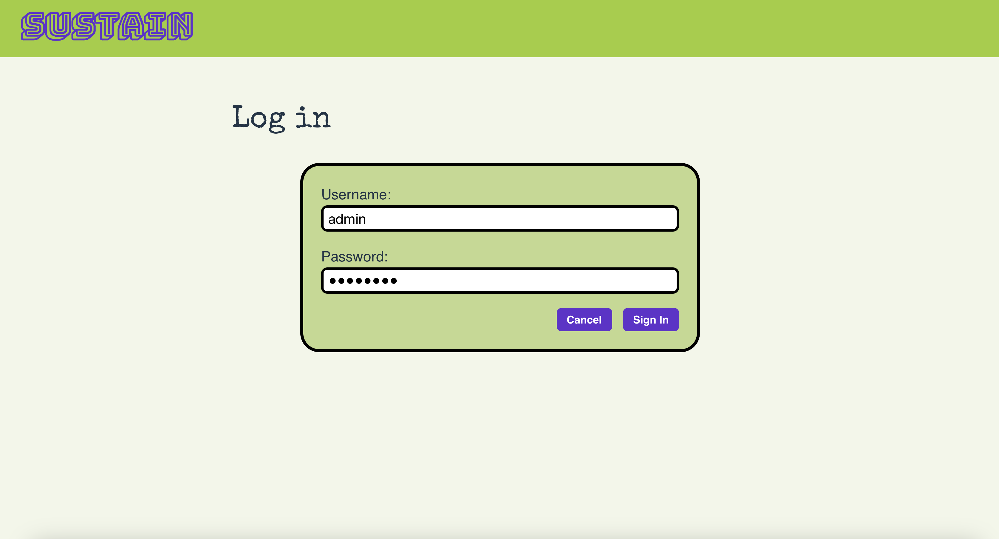

# Sustain - Project Overview

<p align="center">
  
  </a>
</p>

## Screenshot of products view

<p align="center">
  
  </a>
</p>

## Description

**Sustain** is a web app that helps shoppers buy in a more conscious and sustainable way. The products would carry a QR code, that links directly to the product page, giving full product information. Products can also be checked directly on the website.

An individual product page includes a description, a picture, sustainability badges, a category and seasonality graph.

* Back-end: [Back-end](https://sustain-prod-4686c38597f1.herokuapp.com)
* Front-end: [Front-end](http://sustain-prod.netlify.app/)

## Getting Started

### Back-end

Running locally:

Install dependancies:
```
pip install
```

Start:
```
python manage.py runserver
```

### Front-end

Install dependancies:
```
npm install
```

Start:
```
nom run dev
```

Push to GitHub to see latest automatically deployed to Heroku

To view the code for this project, visit the GitHub repository:  
* [**Backend GitHub Repository**](https://github.com/iris-noonan/sustain-backend)
* [**Frontend GitHub Repository**](https://github.com/iris-noonan/sustain-frontend)

## Timeframe & Working Team (Solo/Pair/Group)

This solo project was created in one and a half weeks with an MVP target and several stretch goals. Some stretch goals were met, while others are planned for future development (see below).

## Technologies Used

### Planning and Documentation:
* Markdown
* Figma
* Trello
* dbdiagram.io

### Developer Tools:
* VSCode

### Front End:
* React.js
* HTML
* CSS
* JavaScript

### Back End:
* PostgreSQL
* Python
* Mongoose

### Hosting / Cloud Storage:
* Hekoku (Deployment)
* Cloudinary (Cloud resource storage)


## Brief

This was our final project of the GA course. The requirement was to create a CRUD application using the MERN stack, applying skills learned in the whole bootcamp; with a Python back-end and deployed to Heroku. The deliverables included:
* User stories
* Wireframing
* Planning RESTful routes
* Planning data architecture
* Creating a CRUD site using REACT with an Express backend.

## Planning

* Initial sketches for cocept
* [Figma](https://www.figma.com/design/KJeLigpPh7rrQldhoewIec/Envo?node-id=0-1&p=f&t=9NjsdAVy0fJk9ZHV-0) for page designs
* An [ERD](https://dbdiagram.io/d/Sustain-6732715de9daa85aca15237a) for the project
* I used [Trello](https://trello.com/b/LJk3syLl/⭐%EF%B8%8F-sustain-⭐%EF%B8%8F) to plan and moved tasks as I completed them
* I didn't use any pseudocode for this project

---

## Build / Code Process

Creating a graph for the seasonality section.

State to contain file:
```js
<div className={styles.bars}>
  {seasonality.map((season) => (
    <div key={season.month} className={styles.barArea}>
      <div className={`${styles.bar} ${seasons.includes(season.month) ? styles.positive : styles.neutral}`} />
      <div>
        {season.month}
      </div>
    </div>
  ))}
</div>
```

CSS for graph:
```css
.graph {
  width: 100%;
}

.bars {
  display: flex;
  margin-bottom: 36px;
}

.barArea {
  display: flex;
  flex-direction: column;
  justify-content: flex-end;
  align-items: center;
}

.bar {
  height: 30px;
  width: 20px;
  margin: 4px;
}

@media (min-width: 576px) {
  .bar {
    margin: 10px;
  }
}

.positive {
  background: #9ecd32;
}

.neutral {
  height: 2px;
  background: #646cff;
}
```

Setting up all the different data structures for the database was very challenging. This was the first use of a SQL database in a project. Putting all the theory into practice was very challenging but also very rewarding when it started working. Below is the main section for the main product model.

```py
class Product(models.Model):
    name = models.CharField(max_length=200)
    description = models.TextField(blank=True, null=True)
    photo = models.URLField(blank=True, null=True)
    created_at = models.DateTimeField(auto_now_add=True)
    updated_at = models.DateTimeField(auto_now=True)
    owner = models.ForeignKey(
        to='users.User',
        related_name='owned_products',
        on_delete=models.CASCADE
    )
    seasonality = models.ManyToManyField(
        to='seasonality.Season',
        related_name='products',
        blank=True
    )
    badges = models.ManyToManyField(
        to='badges.Badge',
        related_name='products',
        blank=True
    )
    categories = models.ManyToManyField(
        to='categories.Category',
        related_name='products',
        blank=True
    )
```

## Challenges

* Adapting image upload to Python
* Working with SQL for the first time on project
* Many to many relationships
* Setup for Django and Python
* Having more time to work on the project meant the scope was larger
* Working so much with others was different.
* Adding the image upload took a while.

## Wins

* Finished features ahead of schedule.
* Seasonality calendar.
* Image upload modified for Python.
* Using CSS modules better.
* Better use of component structure.
* This was a more complete product.
* First Python project.

## Key Learnings / Takeaways

* Working on a large project.
* Having back-end ready before working on front-end is a good way to work.
* Extra time is needed when using new deployment methods.
* Styling as you create projects is a better way to work.
* It always takes longer than you think to develop a new feature/
* No matter how well you think you plan there is always things to finish off.
* Python is not as daunting a language as I expected.

## Bugs

Further testing is needed, but for now:
* Some areas are not as responsive as we would like.

## Future Improvements

1. Create admin view
2. Add ability to reset admin account
3. Add ability to delete admin account
4. Allow admins to add categories
5. Allow admins to add badges
6. Add page to generate QR code for product
7. Add page to generate layout for product, including QR code
8. Add more styling
9. Add more detail to the public pages
10. Add public view for products